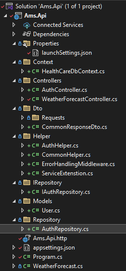

# AMS
This is a simple application to manage patient appointments for a healthcare
clinic. This should include authentication to ensure only authorized users can access or
modify the data.

folder structure (Repository Pattern)

* Context for connecting code first migration to database
* Controller for exposing endpoints
* Dto for facilitating communication without potentially exposing sensitive information
* Helper for storing static methods.
* IRepository & Repository for organizaing Interfaces and implementations
* Models for storing classes representing the data structure of your application

Steps to run this Api:
* appsettings.json : I have put cloud sql database, If you want to run it in your local sql server, Change Connection according to your needs and run update-databse in visual studio or (dotnet ef database update) in visual studio code (terminal).
* type dotnet run in terminal in vs code or press https button on visual studio

Reason for using ULID as primary key over GUID or int:
* Advantages in sortability, readability, and storage efficiency

Used **BCrypt.Net** for password hashing

Added Doctor Endpoint for Create, Update, Delete, Get All, Get By Id (Doctors)

Added in Memory Caching for Appointment Endpoints

Added Pagination for GetAllAppointment endpoint